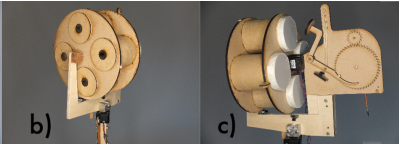

# QuadraVortex

A hand-actuated olfactory cannon that fires **scented toroidal vortices** several metres through the air. Part of an exploration into playful, low-cost scent interaction. Source code developed for Arduino.

---

## Table of Contents
1. [Overview](#overview)  
2. [Bill of Materials](#bill-of-materials)  
3. [Hardware Assembly](#hardware-assembly)  
4. [Firmware](#firmware)  
5. [Fabrication Files](#fabrication-files)  
6. [Operation](#operation)  
7. [Contributing](#contributing)  
8. [License](#license)  

---

## Overview
QuadraVortex consists of four compressed-paper vortex cannons mounted on a laser-cut MDF frame. Two NEMA-17 stepper motors rotate the cannon cluster in both azimuth and elevation, allowing aromatic smoke-ring “bullets” to be aimed in any direction.

* **Scent delivery**: toroidal vortices  
* **Vaporisation**: natural diffusion — 10 drops of essential oil are infused directly into each chamber (cinnamon, ginger, banana, anise)  
* **Application**: material exploration of toroidal vortices as a scent-delivery mechanism  

---

## Bill of Materials

| Category | Parts |
|----------|-------|
| **Microcontroller** | **Arduino Micro** |
| **Motors & Actuators** | Tower Pro SG90 micro-servo (×1) NEMA-17 stepper motors (×2) + A4988/DRV8825 drivers |
| **Sensors** | Air-pressure sensor (for trigger detection) |
| **Electronics** | Breadboard, male↔male & male↔female jumper wires |
| **Scent Materials** | Cinnamon, ginger, banana & anise essential oils (undiluted) |
| **Structure** | Laser-cut MDF panels, 1-4 compressed-paper vortex barrels, latex-glove membranes, 2 gears (different sizes), striker paddle, 5 metal pins, 4 wooden discs, 2 wooden triangles, 2 feet, rubber band, hot-melt adhesive |

---

## Hardware Assembly

1. **Laser-cut** the MDF panels and gears.  
2. **Assemble the frame** with hot-melt glue. Attach feet and triangle supports.  
3. **Build vortex barrels**:  
   * Roll compressed paper into cylinders.  
   * Stretch a latex-glove membrane over the rear opening, securing with a rubber band.  
   * Glue barrels into the rotating turret.  
4. **Mount motors**:  
   * Stepper #1 controls horizontal rotation; Stepper #2 tilts the turret.  
   * Fix A4988/DRV8825 driver modules onto the breadboard and wire.  
5. **Install striker**: connect the SG90 servo to the striker paddle positioned behind the membranes.  
6. **Wire pressure sensor** to detect impact and synchronise servo timing.  
7. **Infuse scent**: add ~10 drops of essential oil into each barrel.  

---
